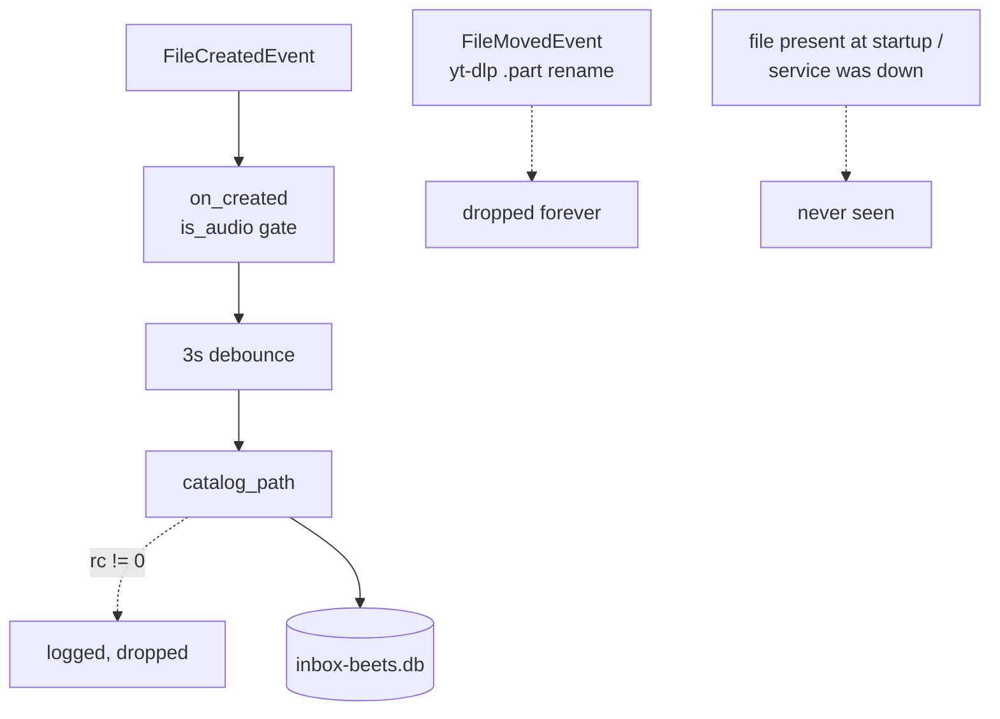

# Architecture review — 2026-08-28

Scoped by TODO.md (watcher bug, sidecar bug, dead tag reader, multi-library
direction). Vocabulary: module / interface / depth / seam / adapter /
leverage / locality (see `/codebase-design`).

Status: recorded, none implemented yet. Line references are as of commit
`3793afb`.

---

## 1 · A reconciling Cataloger — **Strong**

**Files:** `services/inbox.py:263–375` (watcher) · `services/beets.py:83`
(`catalog_path`), `:288` (`query_all_inbox_paths` — dead) ·
`api/inbox.py:87,95` · `main.py:46`

**Problem.** Cataloging happens only on a caught create event.
`_InboxEventHandler` overrides exactly `on_created`; moves (yt-dlp
`.part` → rename), startup backlog, and failed `catalog_path` runs are all
dropped, stranding files in an unrecoverable "Cataloging…" state (TODO
bug #1, live in production — 5 of 7 items). `cataloged` is a bare bool:
pending, failed, and never-attempted are indistinguishable.

**Solution.** Deepen cataloging into one Cataloger module whose interface
is an idempotent `sync()`: diff audio files present in the inbox against
paths in the inbox beets DB, catalog the difference, serialized. Watcher
events (created *and* moved), a periodic timer, and startup all merely
trigger it. The diff primitive already exists as dead code:
`query_all_inbox_paths`.

**Wins**

- locality: missed-event bugs concentrate in `sync()`
- the interface is the test surface — no lifespan harness needed (the
  watcher currently has zero tests because `make_client` skips the
  lifespan)
- watcher shrinks to a trivial trigger adapter
- dead `query_all_inbox_paths` earns its keep
- natural home for serializing beets writes (`_import_lock` is never
  acquired)
- self-heals the stuck production items on next deploy/restart

---

## 2 · One inbox-layout module — **Strong**

**Files:** `services/inbox.py:203` (`scan_inbox`) · `:233` (`get_item`) ·
`:254` (`list_categories`) · `:334` (`_on_new_file`) · `api/inbox.py:70`
(`upload`)

**Problem.** The category/album-group layout rule is re-encoded in five
places that never reference each other, and two of them disagree:

| site | encoding of "layout" |
|---|---|
| `scan_inbox` | top level: dirs only — **files invisible** |
| watcher `_on_new_file` | `rel.parts > 2 → skip` — **admits top-level files** |
| `get_item` | `category = rel.parts[0]` |
| `list_categories` | top-level dir names |
| `upload` | `inbox / (category or default_category)` |

A file dropped in the inbox root gets cataloged into the beets DB but
never appears in the API. This is exactly the rule the multi-library flat
layout rewrites ("top-level file = single, top-level dir = album group").

**Solution.** One module owns "what is an inbox item":
`classify(path) → Single | AlbumGroup | Ignore`, plus enumeration,
category derivation, and upload destination. Watcher and scanner agree by
construction because they call the same interface.

**Wins**

- leverage: the flat redesign lands in one implementation, five callers
  unchanged
- locality: the scanner/watcher-disagreement class of bug dies
- deletion test passes — deleting it scatters the rule back into 5 sites
- classification becomes pure and directly testable

---

## 3 · A sidecar module — **Strong** (small, immediately shippable)

**Files:** `services/inbox.py:52–76` (`_parse_sidecar`) ·
`api/inbox.py:229` (`_clean_sidecars`)

**Problem.** The sidecar filename construction is duplicated **verbatim**
in two files, and both are wrong: they append (`track.m4a` →
`track.m4a.info.json`) where yt-dlp replaces the extension (`track.m4a` →
`track.info.json`) — TODO bug #2, `source_url: null` on every production
item. Fixing only the parse side would leave orphaned sidecars in the
inbox after import. Album groups never look for sidecars at all
(`_parse_sidecar` is gated on `not is_group`). Zero tests; no fixture
writes an info.json.

**Solution.** One module owns finding, parsing, and enumerating sidecars:
`sidecar_paths(audio) → list[Path]` (tries both naming conventions) and
`parse(audio)`. Two call sites already prove the seam is real.

**Wins**

- locality: fix once — lookup and cleanup can't drift apart again
- the interface is the test surface: first sidecar tests, one info.json
  fixture
- album groups gain source metadata behind the same interface

---

## 4 · Library as a value: split ServerConfig / LibraryConfig — **Worth exploring**

**Files:** `config.py:18–53` · `services/beets.py:16–71` (twin templates +
writers) · `main.py:35–47` · `nix/module.nix:113–129`

**Problem.** The single-library assumption is structural: `Config` has
four hardcoded filenames (`inbox-beets.yaml/.db`, `main-beets.yaml/.db`)
that every `_beet` call reaches through; `write_inbox_config` /
`write_main_config` are near-identical 8-line writers over near-identical
templates; the env-var config form can't express a list. Every one of
these blocks the TODO's multiple-target-libraries direction.

**Solution.** Preparatory deepening only: make "a library" a value —
`LibraryConfig` owning name, inbox path, library path, autotag, path
format, plugins, and its own beets config/db pair — held by a
`ServerConfig` whose `libraries` list has length 1 today (env-var form
survives as the single-library shorthand). One parameterized config
writer. API routes (`/api/libraries/{name}/…`), the Elm switcher, and
inbox migration stay deferred; the TODO's open design questions still
stand.

**Wins**

- multi-library becomes additive, not a rewrite
- per-library autotag / path format get their natural home
- config loading becomes testable (`load_config` has zero tests today)
- two config writers collapse into one implementation

---

## Hygiene — not deepenings, just deletions

- `_read_file_tags` (`services/inbox.py:85–124`, TODO bug #3): zero
  callers. With candidate 1's sweep the uncataloged window shrinks to
  seconds, so the wire-it-up-as-fallback option loses its case → delete.
  Also drops mutagen from runtime deps entirely (`pyproject.toml`,
  `flake.nix` pythonDeps), plus the stranded `contextlib` import and the
  redundant `import mutagen`.
- `_import_lock` (`api/inbox.py:25`): never acquired; `threading` imported
  only for it. Delete the lock, keep the invariant — serialize beets
  writes inside candidate 1's Cataloger.
- `get_item` (`services/inbox.py:237`) loads the *entire* inbox tag table
  to build one item, and PATCH/import/DELETE each call it —
  `query_item_tags` already exists for the single-path case.
- `id_to_path` (`services/inbox.py:45`) has no containment guard —
  traversal is contained by accident (via the `relative_to` in
  `get_item`). Add an explicit check while touching the layout module.

Related duplication worth folding into whichever candidate touches it
first: schema discovery copy-pasted in `beets.py` readers (`:230–233` vs
`:265–267`), two path-normalization strategies (`_beets_path` vs inline
decoding), the trailing-slash `path:` query convention (`:126`, `:146`),
and the cleanup sequence duplicated between `_run_import` and
`discard_item`.

---

## Top recommendation

**Candidate 1 (reconciling Cataloger).** It fixes the live production bug
architecturally rather than patching `on_moved` onto an event handler
that will miss the next event class too, and `sync()` self-heals the
stuck items on the next deploy. Its interface is testable without the
lifespan harness that currently walls off the watcher, and it's where the
never-acquired import lock's invariant finally gets enforced. Candidates
2 and 3 slot in behind it: the sweep needs "what counts as an inbox item"
(layout module), and item building needs sidecars found correctly.
